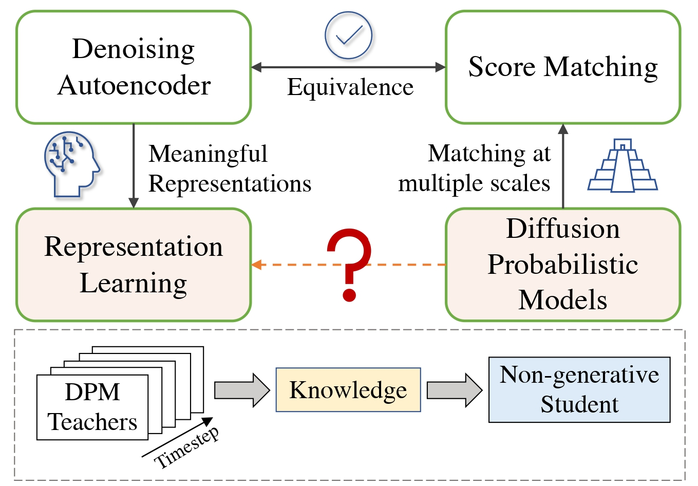

# Diffusion Model as Representation Learner

This repository contains the official implementation of the ICCV 2023 paper

**Diffusion Model as Representation Learner**
Xingyi Yang, Xinchao Wang

[[arxiv](https://arxiv.org/abs/2308.10916)] [[code](https://github.com/Adamdad/Repfusion)]



> In this paper, we conduct an in-depth investigation of the representation power of DPMs, and propose a novel knowledge transfer method that leverages the knowledge acquired by generative DPMs for recognition tasks. We introduce a novel knowledge transfer paradigm named RepFusion. Our paradigm  extracts representations at different time steps from off-the-shelf DPMs and dynamically employs them as supervision for student networks, in which the optimal time is determined through reinforcement learning. 

## File Orgnizations

Basicly, we contain the code for distillation, the 3 downstream tasks including `classification`, `segmentation`, `landmark`

```
             
├── classification_distill/ 
    # code for image classification 
    # and knowledge distillation
    ├── configs/
        ├── <DATASET>-<DISTILL_LOSS>/
            ddpm-<BACKBONE>_<DISTILL_LOSS>.py
            # config file for Repfussion on <DATASET> 
            # with <DISTILL_LOSS> as loss function 
            # and <BACKBONE> as architecture
        ├── baseline/
            <BACKBONE>_<BATCHSIZE>_<DATASET>_finetune.py
    ├── mmcls/
        ├── models/
            ├── guided_diffusion/
                # code taken from the guided diffusion repo
            ├── classifiers/
                ├── kd.py
                    # distillation baselines
                ├── repfusion.py
                    # core code for distillation from diffusion model


├── landmark/
    # code for facial landmark detection 
    ├── configs/face/2d_kpt_sview_rgb_img/topdown_heatmap/wflw
        <BACKBONE>_wflw_256x256_baseline_<BATCHSIZE>.py
        <BACKBONE>_wflw_256x256_<BATCHSIZE>_repfussion.py
            

├── segmentation/
    # code for face parsing
    ├── configs/
        ├── celebahq_mask/
            bisenetv1_<BACKBONE>_lr5e-3_2x8_448x448_160k_coco-celebahq_mask_baseline.py
            bisenetv1_<BACKBONE>_lr5e-3_2x8_448x448_160k_coco-celebahq_mask_repfusion.py

```

## Installation
We mainly depend on 4 packages, namely 
1. `mmclassification`. Please install the enviroment using [INSTALL](https://mmclassification.readthedocs.io/en/latest/install.html)
2. `mmsegmentation`. Please install the enviroment using [INSTALL](https://mmsegmentation.readthedocs.io/en/latest/get_started.html)
3. `mmpose`.  Please install the enviroment using [INSTALL](https://mmpose.readthedocs.io/en/v0.29.0/install.html)
4. `diffusers`. Install via `pip install --upgrade diffusers[torch]`, or go to the [official repo](https://github.com/huggingface/diffusers) for help.

## Data Preparation
We use 4 datasets in our paper. Please put them all under the `data/<DATASET>`

   
1. [CelabAMask-HQ](https://github.com/switchablenorms/CelebAMask-HQ), and please follow the guideline on official repo.
2. [WFLW](https://wywu.github.io/projects/LAB/WFLW.html). For WFLW data, please download images from [WFLW Dataset](https://wywu.github.io/projects/LAB/WFLW.html). Please download the annotation files from [wflw_annotations](https://download.openmmlab.com/mmpose/datasets/wflw_annotations.tar). 
3. [TinyImageNet](http://cs231n.stanford.edu/tiny-imagenet-200.zip), please download dataset using this [script](https://github.com/DennisHanyuanXu/Tiny-ImageNet/blob/master/prep.sh).
4. [CIAFR10](https://www.cs.toronto.edu/~kriz/cifar.html), `mmcls` will automatically download it for you. 


## Teacher Checkpoints
- For DPMs based on huggingface, the model will be automatically downloaded. Just make sure you gets the correct model id, e.g.

- For DPM on Tiny-ImageNet, we download it from the [guided-diffusion](https://github.com/openai/guided-diffusion) repo from the link [weight](https://openaipublic.blob.core.windows.net/diffusion/jul-2021/64x64_diffusion.pt).
   

## Training
- We first do distillation from a trained DPM

```shell script
# <CONFIG_NAME>: config path for distillation 
# <GPU_NUMS>: num of gpus for training
cd classification_distill
bash tools/dist_train.sh <CONFIG_NAME> <GPU_NUMS>
```
- Put the saved checkpoint in config as installization for downstream training. For example
```python
model = dict(
    ...
    backbone=dict(
        ...
        backbone_cfg=dict(
            ...
            init_cfg=dict(
                type='Pretrained', 
                checkpoint=<CHECKPOINT_PATH> , 
                # Put the disilled checkpoint hear
                prefix='student.backbone.')
            )
        ), 
    )
```


- Do downstream training

```shell script
# <CONFIG_NAME>: config path for distillation 
# <GPU_NUMS>: num of gpus for training
# <TASK_NAME>: either 'classification_distill', 'segmentation' or 'landmark'
cd <TASK_NAME>
bash tools/dist_train.sh <CONFIG_NAME> <GPU_NUMS>
```

## Citation
```bibtex
@article{yang2023diffusion,
    author    = {Xingyi Yang, Xinchao Wang},
    title     = {Diffusion Model as Representation Learner},
    journal   = {International Conference on Computer Vision (ICCV)},
    year      = {2023},
}
```